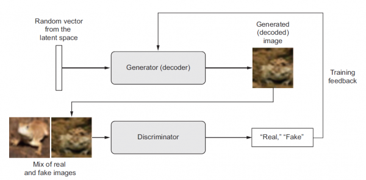

# Wygenerowane pytania na kolokwium nr 2  
1. Co to jest autoenkoder?  
   Odp: Autoenkoder (ang. autoencoder) jest to rodzaj sieci neuronowej, która ma za zadanie przekształcić dane wejściowe w efektywną reprezentację ukrytą, a następnie umieszcza na wyjściu wynik przypominający (przy odrobinie szczęscia) informacje otrzymane na wejściu. 
2. Jaka jest architektura autoenkodera?  
   Odp: Autoenkoder zawsze składa się z dwóch części:
   - enkodera (ang. encoder), zwanego też siecią rozpoznawania (ang. recegnition network), który ma za zadanie przekształcić dane wejściowe w efektywną reprezentację ukrytą (skompresować dane),
   - dekodera (ang. decoder), zwanego też siecią generowania (ang. generative network), który ma za zadanie przekształcić tą reprezentację ukrytą na dane wyjściowe (zdekompresować dane).  
   
   - Dane wyjściowe nazywane są rekonstrukcją (ang. reconstruction), ponieważ dekoder stara się zrekonstruować dane wejściowe. Funkcja kosztu zawiera stratę rekonstrukcji (ang. reconstruction loss), która jest obliczana jako różnica pomiędzy danymi wejściowymi, a danymi wyjściowymi - karzę ona w sytuacji gdy rekonstrukcje różnią się od danych wejściowych.
   - Wewnętrzna skompresowana reprezentacja (ang. compressed representation) ma mniejszą wymiarowość niż dane wejściowe. W przypadku, gdy wymiarowość reprezentacji jest mniejsza niż wymiarowość danych wejściowych, to mówimy o autoenkoderze zredukowanym wymiarowości (ang. undercomplete autoencoder). Niedopełniony autoenkoder nie może po prosu kopiować danych wejściowych do kodowań, ale jest zmuszony do nauczenia się najważniejszych cech danych wejściowych i na ich podstawie wygenerować dane wyjściowe.
3. Jakie zastosowania ma autoenkoder?  
   Odp: Autoenkoder może być wykorzystany do:
   - redukcji wymiarowości danych - skompresowanie danych poprzez uczenie reprezentacji ukrytej o mniejszej wymiarowości niż dane wejściowe,
   - ekstracja cech - uczenie reprezentacji ukrytej, która zawiera najważniejsze cechy danych wejściowych,
   - generowania danych - uczenie reprezentacji ukrytej, która pozwala na generowanie nowych danych, które są podobne do danych wejściowych,
   - usuwania szumu - Denoising Autoencoder (DAE) jest to autoenkoder, który uczy się usuwać szum z danych wejściowych. W tym celu dane wejściowe są zaszumiane, a następnie autoenkoder ma za zadanie zrekonstruować dane wejściowe bez szumu. W ten sposób autoenkoder uczy się wyodrębniać najważniejsze cechy danych wejściowych.
4. Opisz dwie architektury autoenkodera zastosowane na laboratoriach:  
   Odp:  
   Prosty autoenkoder (ang. simple autoencoder) - Architektura tego autoenkodera jest bardzo prosta i składa się z jednej warstwy w pełni połączonej (dense) jako enkoder i jednej warstwy w pełni połączonej jako dekoder. Wartość encoding_dim określa rozmiar reprezentacji zakodowanej.
   - Implementacja:
     - enkoder - składa się z jednej warstwy dense z funkcją aktywacji relu oraz encoding_dim neuronów,
     - dekoder - składa się z jednej warstwy dense z funkcją aktywacji sigmoid oraz liczby neuronów odpowiadającej liczbie cech danych wejściowych,
         ```python
         encoding_dim = 32
         input_img = Input(shape=(784,))
         encoded = Dense(encoding_dim, activation='relu')(input_img)
         decoded = Dense(784, activation='sigmoid')(encoded)
         autoencoder = Model(input_img, decoded)
         ```
     - Odrębne modele są tworzone dla enkodera i dekodera.
         ```python
         encoder = Model(input_img, encoded)
         encoded_input = Input(shape=(encoding_dim,))
         decoder_layer = autoencoder.layers[-1]
         decoder = Model(encoded_input, decoder_layer(encoded_input))
         ```
   - Trening:
     - Model jest trenowany na zbiorze danych MNIST, gdzie obrazy są spłaszczone do wektorów o rozmiarze 784 i znormalizowane do zakresu [0, 1].
     - Funkcja kosztu to binary_crossentropy - ponieważ obrazy są binarne (czarno-białe).
     - Optymalizator to "Adam".  

   Konwolucyjny autoenkoder (ang. Convolutional Autoencoder) - architektura tego autoenkdora jest bardziej skomplikowana i lepiej dostosowana do pracy z obrazami. Enkoder zawiera warstwy konwolucyjne (Conv2D) oraz warstwy MaxPooling, a dekoder korzysta z warstw Conv2D i UpSampling2D.
   - Implementacja:
     - enkoder - składa się z warstw konwolucyjnych (Conv2D) i warstw MaxPooling - zmniejszających wymiarowość danych,
     - dekoder - składa się z warstw Conv2D do odtwarzania danych (zwiększających wymiarowość danych) oraz warstw UpSampling2D.
     - Funkcja aktywacji ReLU jest używana w większości warstw, a na końcu dekodera jest warstwa sigmoid.
         ```python
         input_img = Input(shape=(28, 28, 1))
         x = Conv2D(16, (3, 3), activation='relu', padding='same')(input_img)
         x = MaxPooling2D((2, 2), padding='same')(x)
         x = Conv2D(8, (3, 3), activation='relu', padding='same')(x)
         x = MaxPooling2D((2, 2), padding='same')(x)
         x = Conv2D(8, (3, 3), activation='relu', padding='same')(x)
         encoded = MaxPooling2D((2, 2), padding='same')(x)
         x = Conv2D(8, (3, 3), activation='relu', padding='same')(encoded)
         x = UpSampling2D((2, 2))(x)
         x = Conv2D(8, (3, 3), activation='relu', padding='same')(x)
         x = UpSampling2D((2, 2))(x)
         x = Conv2D(16, (3, 3), activation='relu')(x)
         x = UpSampling2D((2, 2))(x)
         decoded = Conv2D(1, (3, 3), activation='sigmoid', padding='same')(x)
         autoencoder = Model(input_img, decoded)
         ```
   - Trening:
     - Model jest trenowany na danych MNIST, ale tym razem są one używane w formie (samples, 28, 28, 1), gdzie 1 oznacza jedną warstwę kanału (skala szarości).
     - Funkcja straty to nadal binary crossentropy, a optymalizator to Adam.

   Różnice pomiędzy modelami:
   |                  | Prosty Autoenkoder                                        | Konwolucyjny Autoenkoder                                 |
   |------------------|-----------------------------------------------------------|---------------------------------------------------------|
   | **Warstwy**      | Warstwy w pełni połączone (dense) dla enkodera i dekodera | Warstwy konwolucyjne, MaxPooling i UpSampling dla enkodera i dekodera |
   | **Wymiarowość**  | Spłaszczane wektory o długości 784 dla obrazów MNIST      | Dane w formie tensora o wymiarach (28, 28, 1), zachowujące informacje przestrzenne |
   | **Struktura**    | Brak uwzględnienia struktury przestrzennej obrazów         | Utrzymanie struktury przestrzennej dzięki konwolucjom i warstwom Pooling/UpSampling |
   | **Aktywacje**    | ReLU w enkoderze, sigmoid w dekoderze                     | ReLU w większości warstw, sigmoid w ostatniej warstwie dekodera |
   | **Odrębne Modele** | Odrębne modele dla enkodera i dekodera                    | Odrębne modele dla enkodera i dekodera, zintegrowane w jeden model autoenkodera |

5. Co to jest sieć GAN?
   Odp: Sieć generatywna przeciwstawna (ang. Generative Adversarial Network) jest to rodzaj sieci neuronowej, która składa się z dwóch sieci neuronowych, które są ze sobą sprzeczne. Pierwsza sieć jest generatorem, który ma za zadanie generować nowe dane, a druga sieć jest dyskryminatorem, który ma za zadanie rozpoznawać czy dane są prawdziwe czy wygenerowane przez generator. Sieci te działają równolegle i uczą się na podstawie siebie nawzajem.  
   
6. Jaka jest architektura sieci GAN?  
   Odp: Sieć GAN składa się z dwóch sieci neuronowych:
   - generatora (ang. generator), który ma za zadanie generować nowe dane przypominające przykłady ze zbioru treningowego,
   - dyskryminatora (ang. discriminator), który ma za zadanie rozpoznawać czy dane są prawdziwe czy wygenerowane przez generator.
   Generator i dyskryminator współzawodniczą ze sobą w fazie uczenia się. Jest to uczenie przeciwstawne (ang. adversarial training).
7. Jakie są zastosowania sieci GAN?  
   Odp: Sieci GAN są stosowane do generowania obrazów, muzyki, tekstu, wideo, itp. Wynika to z faktu, że sieci GAN są w stanie generować nowe dane, które są podobne do danych, na których zostały wytrenowane.
8. Trenowanie sieci GAN?  
   Odp: Sieć GAN tworzą dwie struktury o przeciwstawnych zadaniach, więc trening nie może przebiegać w standardowy sposób i powinien przebiegać w dwóch fazach:
    - trening dyskryminatora - w tej fazie trenujemy dyskryminatora, który ma za zadanie rozpoznawać czy dane są prawdziwe czy wygenerowane przez generator. Z zestawu danych uczących losowana jest grupa rzeczywistych przykładów i grupa przykładów wygenerowanych przez generator. Następnie obie grupy są podawane na wejście dyskryminatora, który ma za zadanie rozpoznać, które dane są prawdziwe, a które wygenerowane. Następnie obliczany jest błąd i aktualizowane są wagi dyskryminatora. Jako funkcję błędu można wykorzystać np. błąd średniokwadratowy (ang. mean squared error) lub binarna entropia krzyżowa (ang. binary cross entropy). W tej fazie algorytm propagacji wstecznej jest wykorzystywany tylko do aktualizacji wag dyskryminatora.
    - trening generatora - w tej fazie trenujemy generator, który ma za zadanie generować nowe dane przypominające przykłady ze zbioru treningowego. Następnie obliczany jest błąd i aktualizowane są wagi generatora. Tworzona jest nowa grupa imitacji i podawana jest na wejście dyskryminatora, który ma za zadanie rozpoznać, które dane są prawdziwe, a które wygenerowane. Następnie obliczany jest błąd i aktualizowane są wagi dyskryminatora. Jako funkcję błędu można wykorzystać np. błąd średniokwadratowy (ang. mean squared error) lub binarna entropia krzyżowa (ang. binary cross entropy). W tej fazie algorytm propagacji wstecznej jest wykorzystywany tylko do aktualizacji wag generatora.
9.  Jakie są wady sieci GAN?  
   Odp: 
   - Sieci GAN są trudne w trenowaniu, ponieważ wymagają zbalansowania generatora  i dyskryminatora. Ponadto sieci GAN są wrażliwe na hiperparametry, które należy odpowiednio dobrać.
   - Drugim problemem jest zjawisko równowagi Nasha (ang. Nash equilibrium), na którą sieci GAN są podatne. Polega ono na tym, że ani generator, ani dyskryminator nie mogą poprawić swojej sytuacji, jeśli druga strona nie zmieni swojej strategii. W takiej sytuacji sieć GAN może utknąć w minimum lokalnym.
   - Pojawia się również problem tzw. załamania modu (ang. mode collapse), który polega na tym, że generator zaczyna generować coraz mniej różnorodne dane, aż w końcu zaczyna generować tylko jeden przykład.
10. Porównaj autoenkodery z siecią GAN:  
    Odp:  

      |                       | Autoenkodery                                               | Sieci GAN (Generatywne Adwersarialne)                     |
      |-----------------------|------------------------------------------------------------|---------------------------------------------------------|
      | **Struktura**         | Enkoder, kod, dekoder; Warstwy w pełni połączone lub konwolucyjne | Generator, dyskryminator; Dwa oddzielne modele konkurujące |
      | **Trening**           | Uczenie nienadzorowane, minimalizacja błędu rekonstrukcji   | Uczenie adwersarialne, oszukiwanie i rozpoznawanie danych  |
      | **Zastosowanie**      | Redukcja wymiarowości, ekstrakcja cech, rekonstrukcja, generowanie podobnych przykładów | Generowanie nowych danych (obrazu, dźwięku, tekstu), szczególnie realistycznych      |
      | **Funkcja Kosztu**    | Błąd rekonstrukcji                                         | Funkcja adwersarialna                                     |
      | **Złożoność**         | Zazwyczaj łatwiejsze w treningu i bardziej stabilne         | Mogą być bardziej wymagające i niestabilne w treningu      |
      | **Generowanie Danych** | Generowanie na podstawie struktury treningowych przykładów  | Generowanie zupełnie nowych, realistycznych danych         |

      **Cel:**
       - **Autoenkodery:** Służą głównie do redukcji wymiarowości, ekstrakcji cech, rekonstrukcji danych i generowania podobnych przykładów do tych użytych w treningu.
       - **GANs:** Zaprojektowane są do generowania nowych danych, a ich głównym celem jest tworzenie realistycznych przykładów, które niekoniecznie muszą odpowiadać strukturze danych treningowych.

      **Struktura:**
      - **Autoenkodery:** Składają się z enkodera, kodera i dekodera, zazwyczaj z warstwami w pełni połączonymi lub konwolucyjnymi.
      - **GANs:** Zawierają generator, który tworzy dane, oraz dyskryminator, który ocenia ich autentyczność. GANs składają się z dwóch oddzielnych modeli konkurujących ze sobą podczas treningu.

      **Trening:**
      - **Autoenkodery:** Są trenowane w procesie uczenia nienadzorowanego na minimalizację błędu rekonstrukcji.
      - **GANs:** Wymagają treningu adwersarialnego, gdzie generator stara się oszukać dyskryminator, a ten ostatni stara się skutecznie odróżniać prawdziwe dane od tych wygenerowanych.

      **Zastosowanie:**
      - **Autoenkodery:** Stosowane są do redukcji wymiarowości, ekstrakcji cech, rekonstrukcji danych, a także do generowania podobnych przykładów.
      - **GANs:** Wykorzystywane są do generowania realistycznych obrazów, tekstów, dźwięków i innych danych syntetycznych.

      **Funkcja Kosztu:**
      - **Autoenkodery:** Funkcją kosztu jest błąd rekonstrukcji, który mierzy różnicę między wejściem a jego rekonstrukcją.
      - **GANs:** Funkcją kosztu jest funkcja adwersarialna, która ocenia zdolność generatora do oszukania dyskryminatora, a także zdolność dyskryminatora do poprawnego identyfikowania prawdziwych danych.

      **Złożoność:**
      - **Autoenkodery:** Są zazwyczaj łatwiejsze w treningu i bardziej stabilne.
      - **GANs:** Mogą być bardziej wymagające pod względem stabilności treningu i dostosowania hiperparametrów.

      **Generowanie Danych:**
      - **Autoenkodery:** Generują dane na podstawie struktury treningowych przykładów, skupiając się na rekonstrukcji.
      - **GANs:** Generują zupełnie nowe dane, które niekoniecznie muszą być podobne do danych treningowych.

      Podsumowując, autoenkodery są używane do redukcji wymiarowości i rekonstrukcji, podczas gdy sieci GAN są skoncentrowane na generowaniu nowych, realistycznych danych. Obydwie te techniki mają różne zastosowania i charakteryzują się innymi cechami w kontekście treningu i generacji danych.

11. Co to jest sieć U-Net?  
    Odp: U-Net to głęboka sieć neuronowa stosowana w zadaniach segmentacji obrazu, stworzona przez Olafa Ronnebergera, Philippa Fischera i Thomasa Broxa w 2015 roku. Jego nazwa pochodzi od charakterystycznego kształtu architektury, który przypomina literę "U". U-Net jest szczególnie skuteczny w rekonstrukcji obrazów o wysokiej rozdzielczości, co czyni go popularnym w medycynie i innych dziedzinach.

12. Jaka jest architektura sieci U-Net?  
    Odp:  
    Składa się ona z dwóch części: enkodera i dekodera.
    - Enkoder - składa się z:
      - warstw konwolucyjnych (Conv2D), które służą do ekstrakcji cech z obrazu wejściowego. 
      - Po każdej warstwie konwolucyjnej następuje warstwa normalizacji i aktywacji ReLU, co pozwala na naukę nieliniowych zależności. 
      - Warstwy konwolucyjne są zazwyczaj połączone z warstwami MaxPooling, które zmniejszają wymiarowość danych. W ten sposób enkoder uczy się wyodrębniać najważniejsze cechy obrazu wejściowego.
    - Dekoder - rozpoczyna się:
      - warstwą transponowanych konwolucji (Conv2DTranspose)i warstwą konkatenacji (Concatenate), która zwiększają zwiększają rozdzielczość obrazu. Działa w kierunku rekonstrukcji oryginalnego obrazu na podstawie informacji uzyskanych z enkodera i "connecting parts".
      - Następnie pojawiają się warstwy konwolucyjne, które służą do nauki nieliniowych zależności.
    - Na samym końcu sieci znajduje się warstwa konwolucyjna z:
      - funkcją aktywacji sigmoid, która zwraca obraz o wymiarach takich jak obraz wejściowy
      - lub funkcją aktywacji softmax, która zwraca obraz o wymiarach takich jak obraz wejściowy, ale z wieloma kanałami, gdzie każdy kanał reprezentuje inny obiekt.

    Dodatkowo można wyodrębnić:
    - Connecting Parts - są to warstwy konwolucyjne, które łączą enkoder i dekoder. Te połączenia przekazują informacje z warstw enkodera bezpośrednio do odpowiednich warstw dekodera. W ten sposób dekoder może nauczyć się rekonstruować obraz na podstawie informacji uzyskanych z enkodera. Dzięki nim, model może skupić się zarówno na ogólnych kontekstach, jak i lokalnych szczegółach.
    - Bottleneck - jest to najniższa, centralna wartstwa sieci, charakteryzująca się głębokimi warstwami konwolucyjnymi. W tym miejscu sieć zawiera najwięcej informacji o obrazie wejściowym, a także najwięcej informacji o kontekście. To miejsce, gdzie zachowuje się ogólny kontekst, ale redukuje się rozmiar danych, aby zmniejszyć złożoność obliczeniową.  

    

13. Jak działa U-Net Segmentation?  
Odp: Podczas trenowania U-Net, enkoder przetwarza obraz wejściowy, ekstrahując stopniowo cechy na różnych poziomach abstrakcji. "Connecting parts" przekazują te cechy do odpowiednich warstw dekodera, gdzie są używane do rekonstrukcji oryginalnego obrazu. Bottleneck pełni rolę skondensowanego miejsca reprezentacji, co umożliwia modelowi skuteczne utrzymanie zarówno ogólnego kontekstu, jak i lokalnych detali.

14.  Jakie są zastosowania sieci U-Net?  
Odp: Sieci U-Net są stosowane do segmentacji obrazu, czyli podziału obrazu na obszary, które reprezentują różne obiekty. Sieci U-Net są szczególnie skuteczne w rekonstrukcji obrazów o wysokiej rozdzielczości, co czyni je popularnymi w medycynie i innych dziedzinach.

15.  Jakie są wady i problemy w sieci U-Net?  
Odp: Wadą U-Net może być skłonność do przeuczenia, zwłaszcza przy ograniczonej ilości dostępnych danych treningowych. Konieczność posiadania dużej ilości danych do skutecznego treningu może być wyzwaniem. Warto również zauważyć, że dla niektórych zastosowań, gdzie struktury są małe lub trudne do w pełni zdefiniowania, może wystąpić trudność w dokładnym odwzorowaniu granic obiektów. Odpowiednie dostosowanie hiperparametrów jest kluczowe, aby uniknąć problemu przeuczenia i uzyskać optymalne wyniki. Rozwiązaniem problemu z brakiem odpowiedniej ilości danych może być wykorzystanie technik augmentacji danych.

16. Co to jest word embedding?  
   Odp: Word embedding (pl. reprezentacje właściwościowe słów) - to technika przyporządkowywania słowom wektorów liczb rzeczywistych. Często początkowo są inicjalizowane losowo, a następnie wyuczone wraz z innymi warstwami sieci neuronowej.
   - W przeciwieństwie do one-hot encoding, reprezentacje właściwościowe słów są wyuczane na podstawie kontekstu, w którym słowa występują. Dzięki temu słowa o podobnym znaczeniu mają podobne reprezentacje właściwościowe.  
   - Przykład:  
      Synonimy mają bardzo podobne reprezentacje właściowościowe (embedding), a powiązane semantycznie wyrazy, takie jak Francja, Hiszpania czy Włochy, zostają pogrupowane w klastry.
     

17. Co to jest one-hot encoding (pl. kodowanie gorącojedynkowe)?  
   Odp: One-hot encoding - to technika przyporządkowywania słowom wektorów liczb rzeczywistych. Wszystkie słowa są reprezentowane przez wektory o takiej samej długości, a każdy wektor zawiera tylko jedną jedynkę, która wskazuje pozycję słowa w słowniku.
   - W przeciwieństwie do reprezentacji właściwościowych słów, one-hot encoding nie jest wyuczany na podstawie kontekstu, w którym słowa występują.

18. Co to jest RNN?
    Odp: Recurrent Neural Network (RNN) - rekurencyjne sieci neuronowe są to sieci neuronowe, które są w stanie przetwarzać sekwencje danych - analizować dane szeregów czasowych. Ze względu na ich rekurencyjną architekurę są w stanie zapamiętywać informacje z przeszłości i wykorzystywać je do przetwarzania kolejnych danych (prognozować dane w przyszłości).

19. Jak jest architektura RNN?  
    Odp:  
    Działanie RNN jest zdeterminowane przez kilka fundamentalnych koncepcji:
    - sekwencja danych - dane wejściowe są sekwencją danych, które są przetwarzane w kolejnych krokach czasowych,
    - stan ukryty (ang. hidden state) - stan ukryty jest wektorem, który przechowuje informacje o danych z przeszłości. W każdym kroku czasowym stan ukryty jest aktualizowany na podstawie danych wejściowych i stanu ukrytego z poprzedniego kroku czasowego. W ten sposób stan ukryty przechowuje informacje o danych z przeszłości, które są wykorzystywane do przetwarzania kolejnych danych.
    - warstwa rekurencyjna (ang. recurrent layer) - warstwa rekurencyjna jest warstwą, która jest używana do przetwarzania sekwencji danych. W każdym kroku czasowym warstwa rekurencyjna aktualizuje stan ukryty na podstawie danych wejściowych i stanu ukrytego z poprzedniego kroku czasowego. W ten sposób warstwa rekurencyjna przechowuje informacje o danych z przeszłości, które są wykorzystywane do przetwarzania kolejnych danych.
    - komórki pamięci - fragment sieci neuronowej przechowującej informacje o stanie w poszczególnych taktach (krokach czasowych). W przypadku RNN komórki pamięci są reprezentowane przez stan ukryty.
    - uczenie sieci rekurencyjnej jest opartę o propagację wsteczną w czasie (ang. backpropagation through time), która jest rozszerzeniem propagacji wstecznej na sieci rekurencyjne. W przypadku propagacji wstecznej w czasie, błąd jest propagowany wstecz przez wszystkie kroki czasowe, a następnie aktualizowane są wagi sieci rekurencyjnej.
  
20. Co to jest propagacja wsteczna (ang. backpropagation)?  
    Odp: Propagacja wsteczna jest to algorytm uczenia sieci neuronowych, który polega na propagowaniu błędu wstecz przez sieć neuronową i aktualizacji wag na podstawie tego błędu. Algorytm propagacji wstecznej jest stosowany w sieciach neuronowych z warstwami w pełni połączonymi (dense layers) i konwolucyjnymi (convolutional layers). W przypadku sieci rekurencyjnych (RNN) stosowana jest propagacja wsteczna w czasie (ang. backpropagation through time).
    

23. Jakie są wady/wyzwania sieci RNN?  
    Odp:  
    - Niestabilne gradienty (ang. vanishing/exploding gradients) - w przypadku długich sekwencji sieci RNN mogą mieć problem z propagacją gradientu. W przypadku długich sekwencji gradient może maleć lub rosnąć eksponencjalnie, co prowadzi do problemów z uczeniem się.
    - Ograniczona pamięć krótkoterminowa (ang. short-term memory) - sieci RNN mają ograniczoną pamięć krótkoterminową, co oznacza, że nie są w stanie zapamiętać informacji zbyt długo. W przypadku długich sekwencji sieci RNN mogą zapomnieć informacje z początku sekwencji.
      - Rozwiązaniem tego problemu są sieci LSTM i GRU, które są w stanie zapamiętać informacje na dłużej.

24. Co to jest LSTM (Long Short-Term Memory)?  
    Odp: Long Short-Term Memory (LSTM) jest to szczególny rodzaj sieci rekurencyjnej, który został zaproponowany przez Seppa Hochreitera i Jürgena Schmidahubera w 1997 roku. LSTM jest szczególnie skuteczny w przetwarzaniu języka naturalnego (NLP), ale może być również stosowany w innych dziedzinach. LSTM jest modelem bez nadzoru, który nie wymaga etykietowanych danych treningowych. Pozwala na szybsze uzyskanie zbieżności niż standardowe sieci rekurencyjne oraz jest w stanie wykrywać długoterminowe wzorce w danych.

25. Jak działa komórka/warstwa LSTM?  
    Odp: Struktura została pokazana na rysunku poniżej.

      
    - architekura zakłada istnienie trzech bramek (ang. gates):
      - bramka zapominająca (ang. forget gate) - decyduje, które informacje powinny zostać zapomniane,
      - bramka wejściowa (ang. input gate) - decyduje, które informacje powinny zostać zapamiętane,
      - bramka wyjściowa (ang. output gate) - filtruje, które informacje powinny być spropagowane na wyjście komórki i wykorzystane do obliczenia stanu ukrytego (ang. hidden state).
    - wewnątrz komórki znajdują się trzy warstwy zwane kontrolerami bramek (ang. gate controllers), które są odpowiedzialne za sterowanie wyżej wymionymi bramkami.
      - warstwy korzystają z logistycznej funkcji aktywacji - wyniki 0-1,
        - 0 - bramka jest zamknięta,
        - 1 - bramka jest otwarta.

26. Co robi `return_sequences` w warstwach rekurencyjnych z biblioteki Keras?  
    Odp: Parametr `return_sequences` określa, czy warstwa rekurencyjna ma zwracać stan ukryty dla każdego kroku czasowego (True) czy tylko dla ostatniego kroku czasowego (False). Domyślnie parametr `return_sequences` jest ustawiony na False.
    - jest używany w przypadku, gdy warstwa rekurencyjna jest połączona z:
      - kolejną warstwą rekurencyjną,
      - warstwą w pełni połączoną (dense layer).

27. Co robi funkcja `pad_sequences` z biblioteki Keras?  
    Odp: Funkcja `pad_sequences` służy do wyrównywania długości sekwencji. W przypadku sekwencji o różnych długościach, funkcja `pad_sequences` wyrównuje długość sekwencji do najdłuższej sekwencji poprzez dodanie zer na końcu krótszych sekwencji.

28. Co to jest GRU (Gated Recurrent Unit)?  
      Odp: Struktura została pokazana na rysunku poniżej.
      
      

      Gated Recurrent Unit (GRU) jest to szczególny rodzaj sieci rekurencyjnej, który został zaproponowany przez Cho et al. w 2014 roku. Stanowi szczególną, uproszczoną odmianę sieci LSTM oraz osiaga przy tym zbliżoną wydajność.  
      Głowne uproszczenia są następujące:
      - obydwa wektory stanów (ang. hidden state) zostają scalone w jeden wektor,
      - bramka zapominająca (ang. forget gate) i wejściowa są sterowane przez wspólny kontroler bramki (ang. gate controller),
        - innymi słowy za każdym razem gdy wspomnienia mają zostać zachowane, miejsce nanie przeznaczone zostaje napierw wyczyszczone.
      - nie ma bramki wyjściowej - w każdym takcie na wyjściu pojawia się pełny wektor stanu (ang. hidden state).
        - dla równowagi wprowadzono jednak dodatkowy kontroler określając, która część poprzedniego stanu zostanie ukazana na wyjściu.

29. Co to jest BERT?  
    Odp: BERT (Bidirectional Encoder Representations from Transformers) jest to szczególny rodzaj transformera, który został zaproponowany przez developerów Google w 2018 roku. BERT jest szczególnie skuteczny w przetwarzaniu języka naturalnego (NLP), ale może być również stosowany w innych dziedzinach. BERT jest modelem językowym, który został wytrenowany na dużym zbiorze danych, aby nauczyć się reprezentacji słów. BERT jest modelem bez nadzoru, który nie wymaga etykietowanych danych treningowych.

30. Co to jest Hugging Face?  
    Odp: Hugging Face jest firmą dostarczającą między innymi open-source bibliotekę transformers, która zawiera wiele modeli językowych, w tym BERT. Biblioteka ta jest napisana w języku Python i jest oparta na bibliotece PyTorch. Hugging Face jest również platformą społecznościową, na której użytkownicy mogą dzielić się swoimi modelami i danymi.

31. Co to jest Vision Transformer?  
    Odp: Vision Transformer (ViT) jest to architektura sieci neuronowej, która została zaproponowana przez Alexey Dosovitskiy i innych w 2020 roku (An Image is Worth 16x16 Words: Transformers for Image Recognition at Scale). Jest to architektura bez rekurencji, która wykorzystuje mechanizm uwagi (ang. attention mechanism) do przetwarzania sekwencji. Vision Transformers są szczególnie skuteczne w przetwarzaniu obrazów, ale mogą być również stosowane w innych dziedzinach.

32. Jak działa Vision Transformer?  
    Odp: Koncepcja działa ViT polega na podziale obrazu na fragmenty (ang. patches), które są przekształcane w wektory i podawane na wejście modelu. Następnie model wykorzystuje mechanizm uwagi (ang. attention mechanism) do przetwarzania tych wektorów. W ten sposób model uczy się reprezentacji obrazu, która jest wykorzystywana do klasyfikacji.
    - obraz jest dzielony na 16x16 fragmentów (ang. patches), które są traktowane jako sekwencja wektorów - oznacza to, że siatka 16x16 fragmentów jest spłaszczona do 16x16x3 = 768-wymiarowych wektorów (3 oznacza trzy kanały RGB),
    - otrzymana sekwencja jest interpretowana jako embeddingi (reprezentacje właściwościowe) - co pozwala na dalsze przetwarzanie przez model (przez Transformer),

33. Do czego są wykorzystywane Vision Transformers?  
    Odp:  
    - Vision Transformers są stosowane do klasyfikacji obrazów, czyli przyporządkowania obrazu do jednej z klas. W tym celu na końcu modelu znajduje się warstwa klasyfikacji, która zwraca prawdopodobieństwo przynależności do każdej z klas.
    - Pozwala przedstawić Attention mapę, która pokazuje, które fragmenty obrazu są najważniejsze dla klasyfikacji.
    - Pozwala dostarczyć wyjaśnialność (explainability) - czyli wytłumaczenie, dlaczego model dokonał konkretnej klasyfikacji (np. wymogi prawne w systemach przyznających kredyty).

34. Co to jest Tokenization?  
    Odp: Tokenization (tokenizacja) jest to proces podziału tekstu na mniejsze części, które nazywamy tokenami. Tokeny mogą być słowami, znakami, wyrażeniami, itp. Tokenizacja jest często wykorzystywana w przetwarzaniu języka naturalnego (NLP), gdzie tekst jest dzielony na tokeny, które są następnie przekształcane w wektory liczb rzeczywistych. Tokenizacja jest również wykorzystywana w innych dziedzinach, takich jak przetwarzanie obrazów, gdzie obraz jest dzielony na fragmenty (ang. patches), które są przekształcane w wektory i podawane na wejście modelu.

35. Co to jest multi-head attention?  
    Odp: Multi-head attention (wieloblokowy mechanizm uwagi) jest to mechanizm uwagi, który jest wykorzystywany w sieciach neuronowych. Mechanizm uwagi pozwala na naukę zależności między elementami sekwencji. Multi-head attention pozwala na wykorzystanie mechanizmu uwagi w wielu różnych przestrzeniach, co pozwala na lepsze wyodrębnienie cech. Multi-head attention jest szczególnie skuteczny w przetwarzaniu języka naturalnego (NLP), ale może być również stosowany w innych dziedzinach.

# Zweryfikowane pytania
1. Co to sieć GAN?  
   Odp: (pytanie 7 z wygenerowanych pytań)

2. Co to jest word embedding?  
   Odp: Word embedding (pl. reprezentacje właściwościowe słów) - to technika przyporządkowywania słowom wektorów liczb rzeczywistych. Często początkowo są inicjalizowane losowo, a następnie wyuczone wraz z innymi warstwami sieci neuronowej.
   - W przeciwieństwie do one-hot encoding, reprezentacje właściwościowe słów są wyuczane na podstawie kontekstu, w którym słowa występują. Dzięki temu słowa o podobnym znaczeniu mają podobne reprezentacje właściwościowe.  
   - Przykład:  
      Synonimy mają bardzo podobne reprezentacje właściowościowe (embedding), a powiązane semantycznie wyrazy, takie jak Francja, Hiszpania czy Włochy, zostają pogrupowane w klastry.
     

3. Co to jest one-hot encoding (pl. kodowanie gorącojedynkowe)?  
   Odp: One-hot encoding - to technika przyporządkowywania słowom wektorów liczb rzeczywistych. Wszystkie słowa są reprezentowane przez wektory o takiej samej długości, a każdy wektor zawiera tylko jedną jedynkę, która wskazuje pozycję słowa w słowniku.
   - W przeciwieństwie do reprezentacji właściwościowych słów, one-hot encoding nie jest wyuczany na podstawie kontekstu, w którym słowa występują.

4. Przepisz kod za pomocą keras API?  
   Odp:
   - przykład:  
   ```python
   # Original model
   input_layer = tf.keras.layers.Input(shape=(28, 28, 1))
   flatten_layer = tf.keras.layers.Flatten()(input_layer)
   dense_layer1 = tf.keras.layers.Dense(128, activation='relu')(flatten_layer)
   dropout_layer = tf.keras.layers.Dropout(0.2)(dense_layer1)
   output_layer = tf.keras.layers.Dense(10, activation='softmax')(dropout_layer)

   # Create model instance
   original_model = tf.keras.Model(inputs=input_layer, outputs=output_layer)
   ```
   - rozwiązanie:  
   ```python
   # Model using the Keras API
   model = tf.keras.Sequential([
    tf.keras.layers.Flatten(input_shape=(28, 28, 1)),
    tf.keras.layers.Dense(128, activation='relu'),
    tf.keras.layers.Dropout(0.2),
    tf.keras.layers.Dense(10, activation='softmax')
   ])
   ```

5. Podaj zastosowania autoenkoderów?  
   Odp: Autoenkodery mogą być wykorzystane do:
   - redukcji wymiarowości danych - skompresowanie danych poprzez uczenie reprezentacji ukrytej o mniejszej wymiarowości niż dane wejściowe,
   - ekstrakcja cech - uczenie reprezentacji ukrytej, która zawiera najważniejsze cechy danych wejściowych,
   - generowania danych - uczenie reprezentacji ukrytej, która pozwala na generowanie nowych danych, które są podobne do danych wejściowych,
   - usuwania szumu - Denoising Autoencoder (DAE) jest to autoenkoder, który uczy się usuwać szum z danych wejściowych. W tym celu dane wejściowe są zaszumiane, a następnie autoenkoder ma za zadanie zrekonstruować dane wejściowe bez szumu. W ten sposób autoenkoder uczy się wyodrębniać najważniejsze cechy danych wejściowych.

6. Opisz architekturę UNet (narysuj), zastosowania sieci?  
   Odp: (pytanie 12, 13, 14 z wygenerowanych pytań)

7. W jaki sposób przetwarza się dane przy szeregach czasowych (podział na zbiory, normalizacja etc.)?  
   Odp: W przypadku zeregów czasowych wymagane jest odpowiednie przetworzenie danych. W tym celu należy:
   - wyekstraktować interesującą nas zmienną (np. temperatura, wilgotność, ciśnienie, itp.) z całego zbioru danych,
   - znormalizować dane - w przypadku sieci neuronowych zalecane jest podzielenie danych przez średnią wartość i odchylenie standardowe,
   - podzielić dane na zbiór treningowy i testowy.

8. Opisz działanie transformerów dla NLP oraz wymień ich zalety?  
   Odp: Transformer jest to architektura sieci neuronowej, która została zaproponowana przez Vaswani et al. w 2017 roku. Jest to architektura bez rekurencji, która wykorzystuje mechanizm uwagi (ang. attention mechanism) do przetwarzania sekwencji. Transformer jest szczególnie skuteczny w przetwarzaniu języka naturalnego (NLP), ale może być również stosowany w innych dziedzinach.
   - Transformer składa się z dwóch części:
     - enkodera, który ma za zadanie przetworzyć sekwencję wejściową,
     - dekodera, który ma za zadanie przetworzyć sekwencję wyjściową.

   - Zalety:
     - Transformer nie wymaga rekurencyjnego przetwarzania sekwencji, co pozwala na równoległe przetwarzanie danych i przyspieszenie obliczeń.
     - Transformer wykorzystuje mechanizm uwagi, który pozwala na wyodrębnienie najważniejszych informacji z sekwencji wejściowej.
     - Jest z powodzeniem stosowanych do długich sekwencji wejściowych, co jest trudne do osiągnięcia w przypadku sieci rekurencyjnych.

9. Dlaczego model o architekurze:  
   Architektura modelu:
   - Embedding layer (max_features=10000, 32)
   - One or more SimpleRNN - 32
   - Dense layer with one neuron and sigmoid activation

   trenował się wolniej niż model z warstwą LSTM?  
   Odp: Jest to związane z tym, że warstwy LSTM oraz GRU zostały zoptymalizowane w bibliotece keras przy użyciu GPU, w oparciu o Nvidia's cuDNN library. W przypadku warstwy SimpleRNN nie została wykorzystana optymalizacja GPU, co powoduje wolniejsze trenowanie modelu. To wsparcie jest dostarczone jednak dla defaultowych wartości hyperparametrów, które są wykorzystywane w warstwie LSTM i GRU. W przypadku zmiany wartości hyperparametrów, może okazać się, że warstwa SimpleRNN będzie szybsza od warstwy LSTM i GRU.

10. Czym różni się architektura klasycznej RNN od GRU?  
    Odp:  
    - używa warstwy GRU zamiast SimpleRNN,
    - ostatnie Dense layer jest bez funkcji aktivacji,
    - używa loss function: mae.

